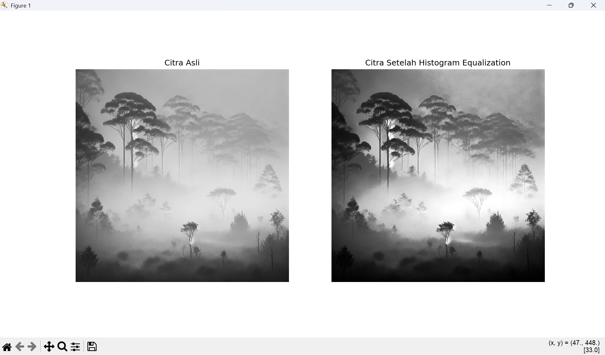
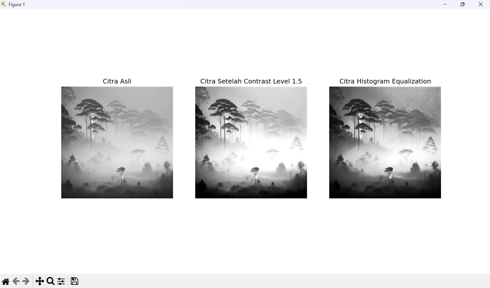

# Informasi Mata Kuliah

Berikut adalah informasi terkait mata kuliah yang diambil:

| Keterangan        | Detail                                 |
|-------------------|----------------------------------------|
| **Mata Kuliah**    | Pengolahan Citra Digital               |
| **Kelas**          | IFD51                                  |
| **Prodi**          | S1 PJJ Informatika                     |
| **Nama Mahasiswa** | Ahmad Fatoni                           |
| **NIM**            | 200401010148                           |
| **Dosen**          | Alun Sujjada, S.Kom., M.T              |

---

# Jawaban UTS_Pengolahan Citra_IFD51

1. **Image enhancement** adalah proses untuk memperbaiki kualitas visual gambar sehingga lebih mudah dipahami atau lebih enak dipandang. Tujuan utamanya adalah menonjolkan detail yang mungkin tersembunyi, meningkatkan perbedaan terang dan gelap (kontras), atau mengurangi gangguan seperti noise. Proses ini dilakukan tanpa mengubah informasi utama dalam gambar, tetapi membantu elemen-elemen penting terlihat lebih jelas.

   Teknik yang digunakan bisa melibatkan penyesuaian kecerahan, ketajaman, dan warna, atau bahkan manipulasi pada frekuensi gambar untuk mengoptimalkan tampilannya. Metode ini digunakan di berbagai bidang, seperti fotografi untuk memperindah hasil tangkapan, medis untuk mempermudah diagnosis dari citra scan, hingga keamanan untuk memperjelas rekaman kamera pengawas. Meski tidak menciptakan informasi baru, image enhancement membuat gambar menjadi lebih bermakna bagi manusia.

2. **Gambar Hasil Histogram Equalization**

   

   Histogram equalization meningkatkan kontras pada gambar dengan mendistribusikan intensitas piksel secara merata. Pada gambar asli (sebelah kiri), area dengan kabut tampak pucat, dan detail pada bayangan atau bagian yang lebih gelap tidak begitu terlihat. Setelah dilakukan histogram equalization (gambar kanan), perbedaan intensitas cahaya menjadi lebih jelas. Hasilnya, detail di area yang sebelumnya sulit terlihat menjadi lebih menonjol, seperti tekstur pohon dan elemen latar belakang. Proses ini sangat berguna untuk meningkatkan visibilitas pada gambar yang memiliki pencahayaan tidak merata.

3. **Gambar Hasil Contrast 1.5 Dengan Perbandingan Histogram Equalization**

   

   a. **Citra Asli**

   Gambar asli memperlihatkan intensitas abu-abu sebagaimana adanya tanpa perubahan. Sebagian area mungkin terlihat kurang jelas karena distribusi intensitas yang belum dioptimalkan.

   b. **Citra Setelah Penyesuaian Kontras**

   Dengan menyesuaikan tingkat kontras hingga 1.5, perbedaan antara bagian terang dan gelap pada gambar menjadi lebih mencolok. Hal ini membantu memperjelas elemen visual yang mungkin sebelumnya kurang terlihat dalam citra asli.

   c. **Citra Setelah Histogram Equalization**
   
   Pada gambar ini, distribusi intensitas telah diatur ulang menggunakan metode histogram equalization. Hasilnya, detail gambar menjadi lebih jelas karena intensitas cahaya tersebar secara merata di seluruh rentang. Gambar pun tampak lebih cerah dan kontrasnya lebih seimbang.
